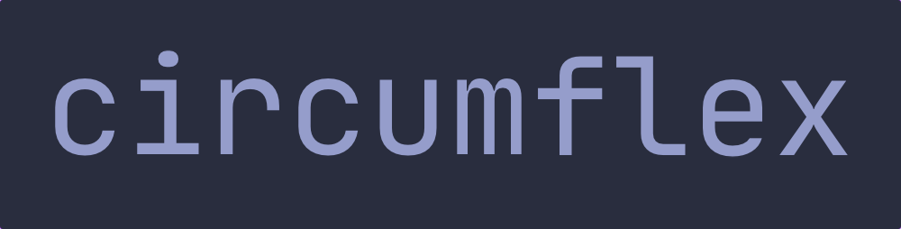
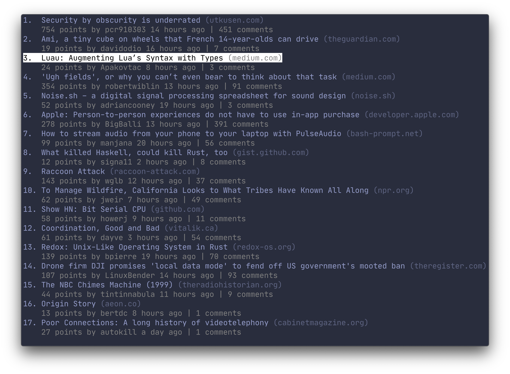
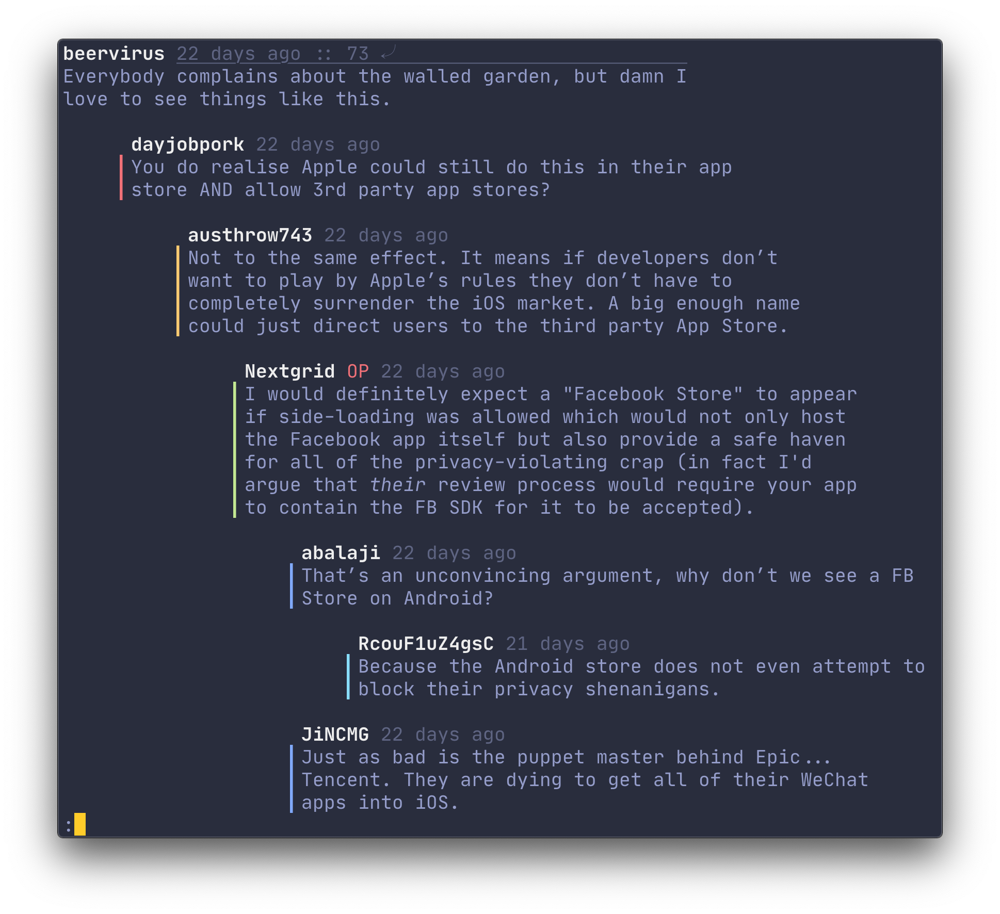
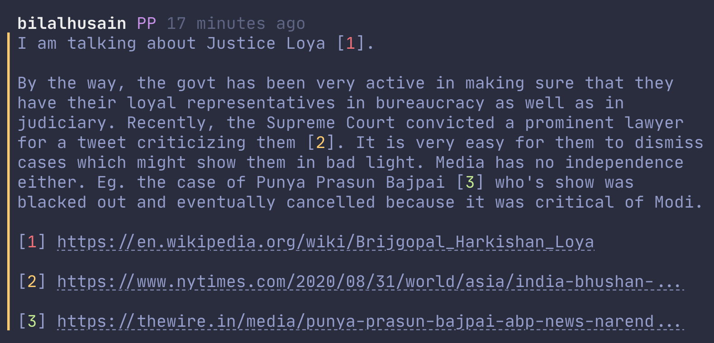

<p align="center">
  
</p>

#
`circumflex` is Hacker&nbsp;News on the command line. It shows top submissions and lets you read the comment section in the pager `less`.

<p align="center">
  
</p>

## Comment section

### Appearance
Should your terminal support the relevant ANSI escape sequences, text will be properly formatted in **bold**, _italics_, [hyperlinks](https://gist.github.com/egmontkob/eb114294efbcd5adb1944c9f3cb5feda) and `code blocks`. Comments are color-indented to distinguish posts from their parents, siblings and children.

<p align="center">
  
</p>

To give context to posts with many replies, Original Poster (OP), Parent Poster (PP) and moderators are labelled. References (`[1], [2], [3], […] `) are color-coded for easier readability.

<p align="center">
  
</p>

### Navigation

`circumflex` pipes comments to the pager `less`. Here is a short recap of commonly used navigation commands:

<pre>
  <kbd>j</kbd>, <kbd>↓</kbd>: forward one line
  <kbd>k</kbd>, <kbd>↑</kbd>: backward one line
  <kbd>d</kbd>: forward one half-window
  <kbd>u</kbd>: backward one half-window
  <kbd>q</kbd>: exit
</pre>

### Jumping between top-level comments
`circumflex` prints every top-level comment with the string `::`. Using `less`'s search functionality, one can move between these posts by searching for `::`.

To navigate between top-level comments, press <kbd>/</kbd> to search for the string `::`. Then, press <kbd>n</kbd> and <kbd>N</kbd> to jump forwards and backwards, respectively.

<pre>  
  <kbd>/</kbd>: search
  <kbd>n</kbd>: repeat search forwards
  <kbd>N</kbd>: repeat search backward
</pre>

`less` remembers your search term between sessions. This means that the next time you want to jump between top-level posts, you can hit <kbd>n</kbd> to go to the next `::` directly.

## Installation
`circumflex` is written in Go. Clone the repo and type:

```console
go install
```

Then run with:

```console
clx
```

## Known issues
The first keystroke is lost when viewing comments in `less`, see [gdamore/tcell#194](https://github.com/gdamore/tcell/issues/194).

## Under the hood
`circumflex` uses:
* [cobra](https://github.com/spf13/cobra) for the CLI
* [tcell](https://github.com/gdamore/tcell) and [cview](https://gitlab.com/tslocum/cview) for the UI
* [cheeaun's unofficial Hacker News API](https://github.com/cheeaun/node-hnapi) for fetching submissions and comments
* [`less`](http://greenwoodsoftware.com/less/) for viewing comments
* [go-term-text](https://github.com/MichaelMure/go-term-text) for wrapping and indenting comments

Screenshots use:
* [iTerm2](https://iterm2.com/) for the terminal
* [Palenight Theme](https://github.com/JonathanSpeek/palenight-iterm2) for the color scheme
* [JetBrains Mono](https://github.com/JetBrains/JetBrainsMono) for the font
