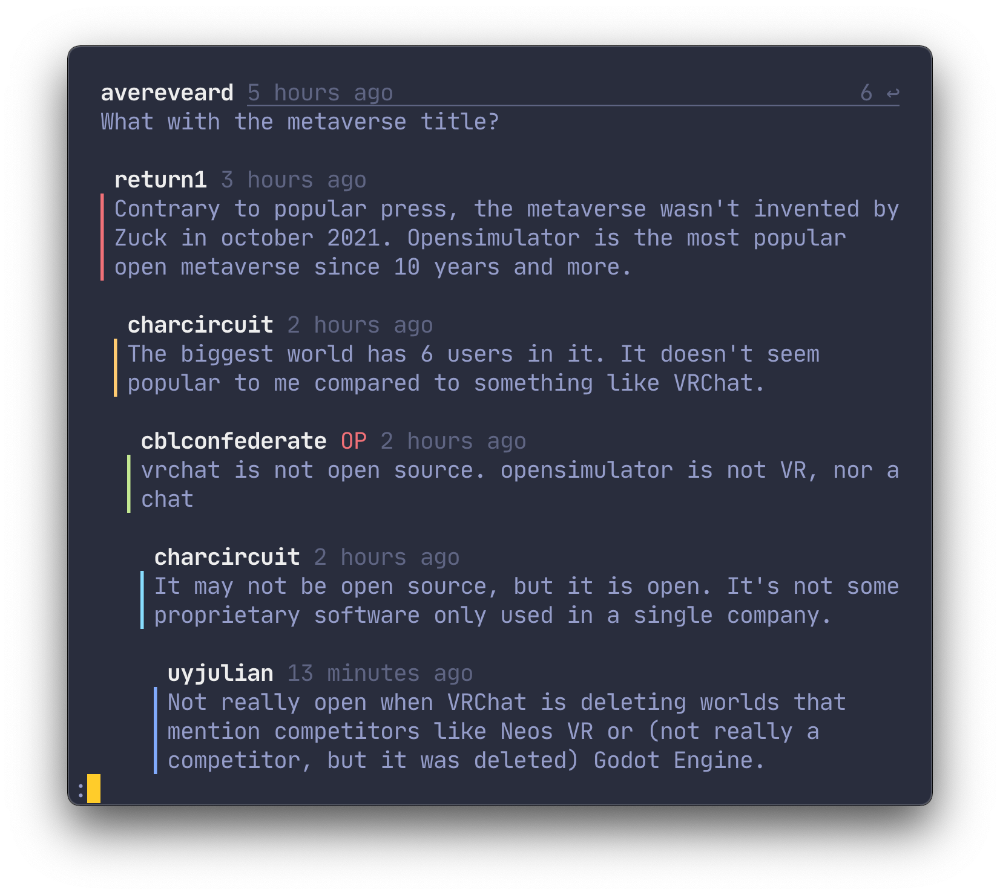

<p align="center">
  
</p>


<p align="center">
<a href="https://github.com/bensadeh/circumflex/releases" target="__blank">
<a href="/CHANGELOG.md" target="__blank"></a>
<a href="/LICENSE" target="__blank"></a>
<a href="/go.mod" target="__blank"></a>
</p>


#

`circumflex` is a command line tool for browsing Hacker News in your terminal.

<p align="center">
  
</p>


## Features

- 🛋 **Everything in one place** - read the comment section or articles in Reader Mode without leaving your terminal
- 🤹 **Native terminal colors** - you bring your own color scheme, `circumflex` does the rest
- ⚡️ **Tools you already know** - articles and comments are piped to the pager `less`
- 🌈 **Syntax highlighting** - syntax-aware formatting for comment quotes, references and submissions headlines
- ⌨️ **Vim keybindings** - including repeat motion and <kbd>g</kbd>
- 🛠 **Configureable** - change comment width, indentation size, highlighting ++
- ❤️ **Add to favorites** - save interesting submissions for later
- 🗄 **Dotfiles and VCS-friendly** - easy to commit your config and favorites to your dotfiles repo

## Installing

### Via Homebrew

```console
# Install
brew install bensadeh/circumflex/circumflex

# Run
clx
```

### From source

```console
# Install
go install

# Run
clx
```

When building from source, make sure the dependencies [`less`](http://greenwoodsoftware.com/less/) and 
[`lynx`](https://lynx.invisible-island.net/lynx.html) are installed on your system.

## Keymaps

<pre>
<kbd>Enter</kbd>: Read comments
<kbd>Space</kbd>: Read article in Reader Mode
<kbd>Tab</kbd>: Change category

<kbd>o</kbd>: Open link to article in browser
<kbd>c</kbd>: Open comment section in browser
<kbd>r</kbd>: Refresh

<kbd>f</kbd>: Add submission to favorites
<kbd>F</kbd>: Add submission to favorites by ID
<kbd>x</kbd>: Remove submission from favorites

<kbd>g</kbd>/<kbd>G</kbd>: Go to line (Vim)

<kbd>q</kbd>: Quit
<kbd>?</kbd>/<kbd>i</kbd>: Show keymaps and settings
</pre>

## Comment section

### Overview
Comments are pretty-printed and piped to the pager `less`. To present a nice and readable comment section,
`circumflex` features:

* Text in **bold**, _italics_, [hyperlinks](https://gist.github.com/egmontkob/eb114294efbcd5adb1944c9f3cb5feda) and
  `code` where available
* Labels for Original Posters (`OP`), Parent Posters (`PP`) and moderators (`mod`)

<p align="center">
  
</p>

### Jumping between top-level comments
`circumflex` prints every top-level comment with the string `::`. Using `less`'s search functionality,
one can move between top-level posts by searching for `::`.

To navigate between top-level comments, press <kbd>/</kbd> to search for `::`. Then, press <kbd>n</kbd> and <kbd>N</kbd> to jump forwards and backwards, respectively.

<pre>  
  <kbd>/</kbd>: search
  <kbd>n</kbd>: repeat search forwards
  <kbd>N</kbd>: repeat search backward
</pre>

`less` remembers your search term between sessions. This means that the next time you want to jump between top-level posts, you can hit <kbd>n</kbd> to go to the next `::` directly.

## Reader Mode
Press <kbd>Space</kbd> to read the submission link in Reader Mode. 


## Syntax highlighting
### Quotes
On Hacker News, quotes are in their own paragraph and open with a `>`. They are not further stylized or formatted.

In `circumflex`, the `>` symbol is omitted and quotes are instead italicised and dimmed.

<p align="center">
  
</p>

### Headlines
Headlines containing the text `Ask HN`, `Tell HN`, `Show HN` and `Launch HN` are highlighted. On by default,
but can be disabled.

<p align="center">
  
</p>

### YC-funded startups
[Twice a year](https://www.ycombinator.com/companies/), Y Combinator funds start-ups through its accelerator program.
`circumflex` highlights these startups to signalize their affiliation with YC. On by default, but can be disabled.

<p align="center">
  
</p>

### References
By convention, references on Hacker News are formatted as numbers inside brackets. `circumflex` highlights these numbers
for easier cross-referencing.

<p align="center">
  
</p>

## Favorites
Save submissions you'd like to revisit by adding them to Favorites. Press <kbd>f</kbd> to add the
currently highlighted submission to your Favorites list. Press <kbd>F</kbd> to add a submission by ID. Submissions can
be removed with <kbd>x</kbd>.

Favorites are stored in `favorites.json` in `~/.config/circumflex`.

## Settings

### Overview
The available options and their current values are displayed in the Settings View. Overridden values are marked with
`*`. To enter Settings View, press <kbd>i</kbd> on the Main View and then <kbd>Tab</kbd> to change the category. Note
that the settings cannot be changed from within the Settings View.

To change the settings, you can either:

1. edit `config.env` in `~/.config/circumflex`, or
2. set environment variables in your shell

### Changing settings through `config.env`
`circumflex` can create a `config.env` template in `~/.config/circumflex` by pressing <kbd>t</kbd> in the Settings View.
Edit this file and uncomment the values you want to change.

### Changing settings with environment variables
Depending on your preference, it might be more convenient for you to configure `circumflex` by setting
[environment variables](https://unix.stackexchange.com/questions/117467/how-to-permanently-set-environmental-variables).
Below are a couple of examples on how to set the variables in different shells. Run the commands directly from your
shell to set the value for the current session. Put the commands in somewhere in your
[dotfiles](https://dotfiles.github.io/) to make the settings permanent.

Bash and zsh:
```bash
export CLX_COMMENT_WIDTH=65
```

Fish:
```fish
set -x CLX_COMMENT_WIDTH "65"
```

### Available options

The following table shows the different ways in which `circumflex` can be configured:

| Key                         | Default Value | Description |
| :-------------------------- | :-------: |---|
| `CLX_COMMENT_WIDTH`         | `70` | Sets the maximum number of characters on each line for comments, replies and descriptions in settings. Set to 0 to use the whole screen.       |
| `CLX_INDENT_SIZE`           | `4` | The number of whitespaces prepended to each reply multiplied by the indent level. |
| `CLX_HIGHLIGHT_HEADLINES`   | `2` | Highlights YC-funded startups and text containing `Show HN`, `Ask HN`, `Tell HN` and `Launch HN`. Can be set to 0 (No highlighting), 1 (inverse highlighting) or 2 (colored highlighting).        |
| `CLX_RELATIVE_NUMBERING`    | `false` | Shows each line with a number relative to the currently selected element. Similar to Vim's hybrid line number mode.        |
| `CLX_HIDE_YC_JOBS`          | `true` | Hides `X is hiring` posts from YC-funded startups. Does not affect the monthly `Who is Hiring?` posts.        |
| `CLX_PRESERVE_RIGHT_MARGIN` | `false` | Shortens replies so that the total length, including indentation, is the same as the comment width. Best used when Indent Size is small to avoid deep replies being too short.   |

## Under the hood

`circumflex` uses:

* [tcell](https://github.com/gdamore/tcell) and [cview](https://code.rocketnine.space/tslocum/cview) for the TUI
* [viper](https://github.com/spf13/viper) for reading and setting configurations
* [cheeaun's unofficial Hacker News API](https://github.com/cheeaun/node-hnapi) for providing stories and comments
* [`less`](http://greenwoodsoftware.com/less/) for viewing comments
* [go-term-text](https://github.com/MichaelMure/go-term-text) for text formatting

Screenshots use:

* [iTerm2](https://iterm2.com/) for the terminal
* [Palenight Theme](https://github.com/JonathanSpeek/palenight-iterm2) for the color scheme
* [JetBrains Mono](https://github.com/JetBrains/JetBrainsMono) for the font
