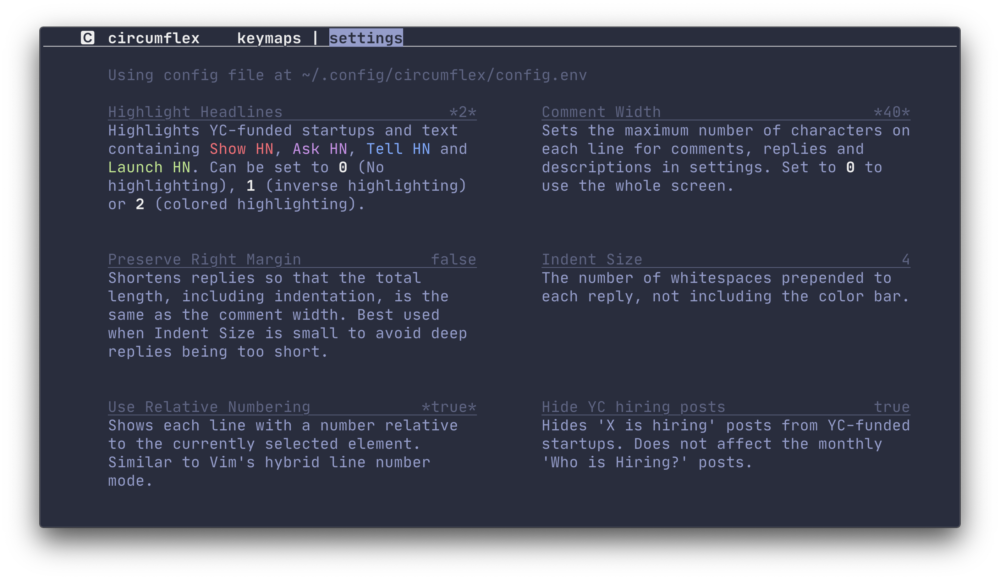

<p align="center">
  
</p>

#

<div align="center">

[](https://github.com/bensadeh/circumflex/releases)
[](https://github.com/bensadeh/circumflex/blob/master/CHANGELOG.md)
[](https://github.com/bensadeh/circumflex/blob/master/LICENSE)
[](https://github.com/bensadeh/circumflex/blob/master/go.mod)
</div>

`circumflex` is a text-based user interface (TUI) application for browsing Hacker&nbsp;News.

<p align="center">
  
</p>

## Installing

### Homebrew

```console
# Add 'bensadeh/circumflex' to list of taps and install
brew install bensadeh/circumflex/circumflex

# Run circumflex
clx
```

## Overview

### Features

`circumflex` is a TUI application that lets you browse Hacker News in your terminal. It can list submissions by category
and show the comment section.

`circumflex` is made to look clean and unobtrusive across different color schemes out of the box. Headline highlighting
marks idiomatic Hacker News posts (`Show HN:` etc.) and can be enabled in the settings.

`circumflex` does not support any login related functionality.

Press <kbd>i</kbd> to show available keymaps and settings.

<p align="center">
  
</p>

### Comment section

Comments are pretty-printed and piped to the pager `less`. To present a nice and readable comment section,
`circumflex` features:

* Text in **bold**, _italics_, [hyperlinks](https://gist.github.com/egmontkob/eb114294efbcd5adb1944c9f3cb5feda) and
  `code` where available
* Indented and color-coded replies
* Colored references (`[1]`, `[2]`, `[…]`)
* Labels for Original Posters (`OP`), Parent Posters (`PP`) and moderators (`mod`)
* Ability to jump between top-level comments by searching for `::`
* Adjustable margins and indentations

<p align="center">
  
</p>

## Settings

### How to configure

Customize the front page and comment section by editing `config.env` in `~/.config/circumflex`. If `config.env` doesn't
exist, `circumflex`
can create one and populated it with the available options along with their default values and descriptions. You can
also export the keys and values from `config.env` as
[environmental variables](https://unix.stackexchange.com/questions/117467/how-to-permanently-set-environmental-variables)
in your shell.

If the same key is simultaneously set in `config.env` and exported in your environment, the environment value will take
precedence.

<p align="center">
  
</p>

### Available options

#### Comment Width

Sets the maximum number of characters on each line for comments, replies and descriptions in settings. Set to 0 to use
the whole screen.

#### Indent Size

The number of whitespaces prepended to each reply, not including the color bar.

#### Highlight Headlines

Highlights text containing `Show HN`, `Ask HN`, `Tell HN` or `Launch HN`. Can be set to 0 (No highlighting), 1 (inverse
highlighting) or 2 (colored highlighting). YC-funded startups are colorized in both option 1 and 2.

#### Use Relative Numbering

Shows each line with a number relative to the currently selected element. Similar to Vim's hybrid line number mode.

#### Hide YC hiring posts

Hides `X is hiring` posts from YC-funded startups. Does not affect the monthly `Who is Hiring?` posts.

## Under the hood

`circumflex` uses:

* [tcell](https://github.com/gdamore/tcell) and [cview](https://gitlab.com/tslocum/cview) for the TUI
* [viper](https://github.com/spf13/viper) for reading and setting configurations
* [cheeaun's unofficial Hacker News API](https://github.com/cheeaun/node-hnapi) for providing submissions and comments
* [`less`](http://greenwoodsoftware.com/less/) for viewing comments
* [go-term-text](https://github.com/MichaelMure/go-term-text) for text formatting

Screenshots use:

* [iTerm2](https://iterm2.com/) for the terminal
* [Palenight Theme](https://github.com/JonathanSpeek/palenight-iterm2) for the color scheme
* [JetBrains Mono](https://github.com/JetBrains/JetBrainsMono) for the font
