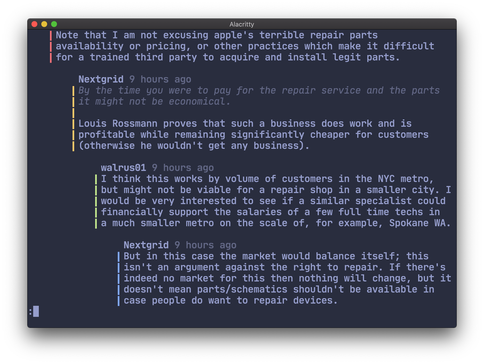
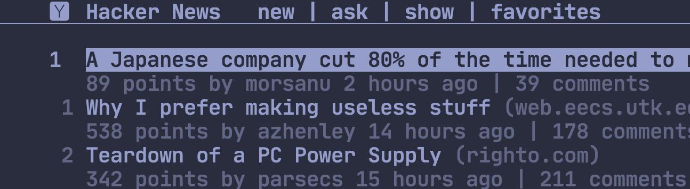

<p align="center">
  
</p>
   
<p align="center">
<a href="https://github.com/bensadeh/circumflex/releases" target="__blank"></a>
<a href="/LICENSE" target="__blank"></a>
<a href="/CHANGELOG.md" target="__blank"></a>
<a href="/go.mod" target="__blank"></a>

</p>

#
  
<p align="center">
  <code>circumflex</code> is a command line tool for browsing Hacker News in your terminal
</p>
  

<p align="center">
  
</p>


### Main features

- 🛋 **Everything in one place** — browse submissions, read articles or view the comment section
- 🌈 **Syntax highlighting** — syntax-aware formatting for comments and headlines
- ⚡️ **Familiar tools** — content is piped to the pager `less` 

**You might also like:**
- 🤹 **Native terminal colors** — you bring your own color scheme, `circumflex` does the rest
- 🛠 **Easy customization** — change settings with flags, environmental variables or config files
- ❤️ **Add to favorites** — save interesting submissions for later

#

### Table of Contents

* [Installing](#-installing)
* [Keymaps](#%EF%B8%8F-keymaps)
* [Comment section](#-comment-section)
###
* [Reader mode](#-reader-mode)
* [Syntax highlighting](#-syntax-highlighting)
* [Favorites](#%EF%B8%8F-favorites)
###
* [Fine tuning](#-fine-tuning)
* [Settings](#%EF%B8%8F-settings)
* [Under the hood](#-under-the-hood)

***

## 📦 Installing

### Via Homebrew

`circumflex` is available as a [Tap](https://docs.brew.sh/Taps).

```console
# Install
brew install bensadeh/circumflex/circumflex

# Run
clx
```

### From source

Make sure the dependencies [`less`](http://greenwoodsoftware.com/less/) and 
[`lynx`](https://lynx.invisible-island.net/lynx.html) are installed on your system.

```console
# Compile and run
go run main.go
```

## ⌨️ Keymaps

Press <kbd>?</kbd>/<kbd>i</kbd> to show a list of available keymaps:

<pre>
<kbd>Enter</kbd>: Read comments
<kbd>Space</kbd>: Read article in Reader Mode

<kbd>r</kbd>: Refresh
<kbd>Tab</kbd>: Change category

<kbd>o</kbd>: Open link to article in browser
<kbd>c</kbd>: Open comment section in browser

<kbd>f</kbd>: Add to favorites
<kbd>x</kbd>: Remove from favorites

<kbd>q</kbd>: Quit
</pre>

## 💬 Comment section

### Overview
Press <kbd>Enter</kbd> to read the comment section. 

Comments are pretty-printed and piped to the
pager `less`. To present a nice and readable comment section, `circumflex` features:

* Text formatting in **bold**, _italics_ and `code` where available
* Labels for Original Posters (`OP`), Parent Posters (`PP`) and moderators (`mod`)
* Adjustable margins and comment width

<p align="center">
  
</p>

### Jumping between top-level comments
`circumflex` prints every top-level comment with the string `::`. Using `less`'s search,
you can move between top-level posts by searching for `::`.

To navigate between top-level comments, press <kbd>/</kbd> to search for `::`. Then, press <kbd>n</kbd> or <kbd>N</kbd> 
to jump forwards or backwards, respectively.

<pre>  
  <kbd>/</kbd>: search
  <kbd>n</kbd>: repeat search forwards
  <kbd>N</kbd>: repeat search backward
</pre>

`less` remembers your search term between sessions. This means that once you have searched for the string `::` once, 
you can use <kbd>n</kbd>/<kbd>N</kbd> directly (without pressing <kbd>/</kbd> first).

In practice, <kbd>n</kbd>/<kbd>N</kbd> becomes another shortcut for navigating the comment section.

## 👓 Reader Mode
Press <kbd>Space</kbd> to read the submission link in Reader Mode in the pager `less`. 

**Note**: some websites do not work well with Reader Mode. If the submission URL points to
a domain with known Reader Mode incompatibility, the link cannot be opened in Reader Mode. See [validator.go](/validator/validator.go) for a full list of incompatible sites.

If you suspect that Reader Mode might work on incompatible domain, and you want to bypass the validation step, 
press <kbd>t</kbd> to open the article. If the validation list is inaccurate, please let me know.

## 🌈 Syntax highlighting
### Quotes
Quotes are indented, italicized and dimmed in order to distinguish them from the rest of the comment.

<p align="center">
  
</p>

### Hacker News and forum idiosyncrasies
Code snippets, `@username` mentions, `$variables` and URLs are highlighted.

<p align="center">
  
</p>

### References
References on Hacker News are formatted as numbers inside brackets. `circumflex` highlights these numbers
for easier cross-referencing.

<p align="center">
  
</p>

### Categories
Headlines containing the text `Ask HN`, `Tell HN`, `Show HN` and `Launch HN` are highlighted.

<p align="center">
  
</p>

### YC-funded startups
[Twice a year](https://www.ycombinator.com/companies/), Y Combinator funds start-ups through its accelerator program.
`circumflex` highlights these startups to signalize their affiliation with YC.

<p align="center">
  
</p>


## ❤️ Favorites
Save submissions you'd like to revisit by adding them to Favorites. Press <kbd>f</kbd> to add the
currently highlighted submission to your list of favorites. Remove submissions from the Favorites 
page with <kbd>x</kbd>.

You can add any submission by its ID from the command line:
```console
clx add [id]
```

Favorites are stored in `~/.config/circumflex/favorites.json`. `circumflex` pretty-prints 
`favorites.json` to make it both human-readable and VCS-friendly.


## 📐 Fine-tuning

### Different standards
`circumflex` aims to be as compatible in as many setups as possible by following standard
terminal conventions. However, not all conventions are agreed upon and not everything is 
standardized. 

Because terminal emulators implementations vary, some adjustment might 
be beneficial for getting most of out of `circumflex`. 

### Disconnected indentation blocks

In some terminals and configurations, the indentation block (the bar to the left of the comment)
might appear disconnected.

<p align="center">
  
</p>

Set `CLX_ALT_INDENT_BLOCK` to `true` to use a different indent block character which will
appear as one connected line.

### Low contrast headers
#### Overview
Terminals can brighten text in bold in order to give them better contrast in dark color 
schemes. `circumflex` uses bold text to give headers and authors names additional contrast 
for better legibility. 

See example screenshots below (low contrast header) and above (low 
contrast author name) of terminal output which does not brighted bold fonts.

<p align="center">
  
</p>

Below are a few examples of how to enable bold text in bright colors in different terminals.

#### Alacritty

- Set `draw_bold_text_with_bright_colors` to `true`
- Define `bright_foreground` and set it to a brighter value than `foreground`
- (See [alacritty/alacritty/pull/1026](https://github.com/alacritty/alacritty/pull/1026) for 
more info)

#### Terminal (macOS)

- Check `Use bright colors for bold text` under Profiles

#### iTerm (macOS)

- Check `Brighten bold text` under Profiles → Colors

## ⚙️ Settings

### Overview
#### Configuration options

There are three ways to configure `circumflex`:

1. run `clx` with flags
2. create a config file in `~/.config/circumflex/config.env`
3. set environment variables in your shell

#### Flags
The easiest and quickest way to configure `circumflex` is by running `clx` with flags.
To see a list of available flags, run the following:

```console
clx help
```

#### Changing settings through `config.env`

The following command will create a config file in  `~/.config/circumflex/config.env`:

```console
clx config
```

The example config contains all the available options. All fields are commented out and set to their default values.
Uncomment and set the values of the settings you want to change.

#### Changing settings with environment variables
You can configure `circumflex` by setting 
[environment variables](https://unix.stackexchange.com/questions/117467/how-to-permanently-set-environmental-variables).
Below are a couple of examples on how to set the variables in different shells. 

Bash and Zsh:
```bash
export CLX_COMMENT_WIDTH=65
```

Fish:
```fish
set -x CLX_COMMENT_WIDTH "65"
```

### Available settings

The following table shows the different ways in which `circumflex` can be configured:

| Key                         | Default | Description |
| :-------------------------- | :-------: |---|
| `CLX_COMMENT_WIDTH`         | `65` | Sets the maximum number of characters on each line for comments, replies and descriptions in settings. Set to 0 to use the whole screen. |
| `CLX_INDENT_SIZE`           | `4` | The number of whitespaces prepended to each reply multiplied by the indent level. |
| `CLX_HIGHLIGHT_HEADLINES`   | `true` | Enables syntax highlighting for the headlines. |
| `CLX_HIGHLIGHT_COMMENTS`    | `true` | Enables syntax highlighting in the comment section. |
| `CLX_EMOJI_SMILEYS`         | `false` | Converts regular smileys to their emoji counterpart. |
| `CLX_MARK_AS_READ`          | `true` | Mark submissions as read after entering the comment section. |
| `CLX_RELATIVE_NUMBERING`    | `false` | Shows each line with a number relative to the currently selected element. Similar to Vim's hybrid line number mode. |
| `CLX_PRESERVE_RIGHT_MARGIN` | `false` | Shortens replies so that the total length, including indentation, is the same as the comment width. Best used when Indent Size is small to avoid deep replies being too short. |
| `CLX_ALT_INDENT_BLOCK`      | `false` | Turn this setting on if the indent block does not appear as one connected line. |
| `CLX_HIDE_YC_JOBS`          | `true` | Hides `X is hiring` posts from YC-funded startups. Does not affect the monthly `Who is Hiring?` posts. |
| `CLX_HIDE_INDENT_SYMBOL`    | `false` | Hides the indentation symbol from the comment section. Does not affect quotes. |

## 🚗 Under the hood

`circumflex` uses:

* [tcell](https://github.com/gdamore/tcell) and [cview](https://code.rocketnine.space/tslocum/cview) for the TUI
* [cobra](https://github.com/spf13/cobra) and [viper](https://github.com/spf13/viper) for the CLI
* [cheeaun's unofficial Hacker News API](https://github.com/cheeaun/node-hnapi) for providing stories and comments
* [`less`](http://greenwoodsoftware.com/less/) for viewing comments
* [`lynx`](https://lynx.invisible-island.net/) for parsing HTML
* [go-term-text](https://github.com/MichaelMure/go-term-text) for text formatting

Screenshots use:

* [iTerm2](https://iterm2.com/) for the terminal
* [Palenight Theme](https://github.com/JonathanSpeek/palenight-iterm2) for the color scheme
* [JetBrains Mono](https://github.com/JetBrains/JetBrainsMono) for the font
