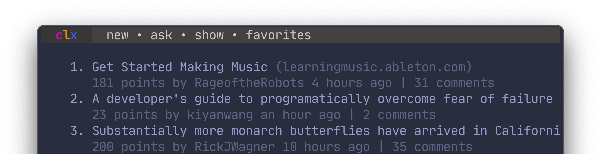
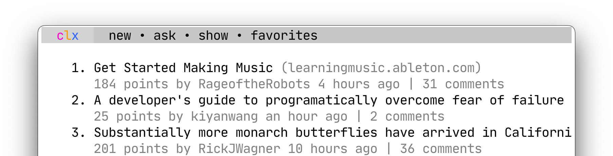
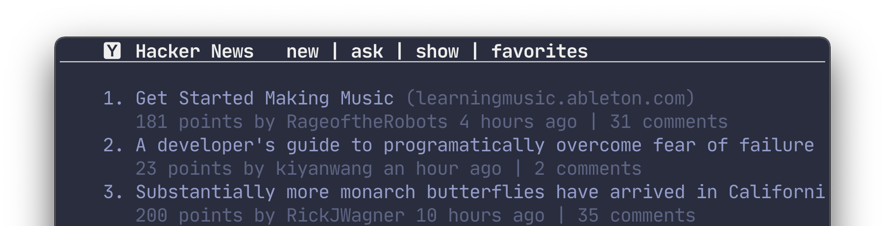
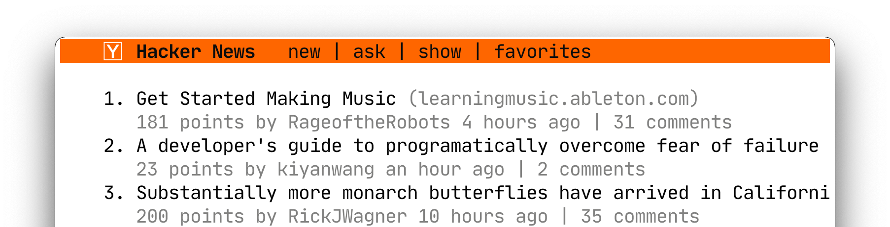

<p align="center">
  
</p>

<p align="center">
<a href="https://github.com/bensadeh/circumflex/releases" target="__blank"></a>
<a href="/LICENSE" target="__blank"></a>
<a href="/CHANGELOG.md" target="__blank"></a>
<a href="/go.mod" target="__blank"></a>
     
#
     
<p align="center">
  <code>circumflex</code> is a command line tool for browsing Hacker News in your terminal
</p>
  

<p align="center">
  
</p>


### Main features

- 🛋 **Everything in one place** — read both the comment section and articles in Reader Mode
- 🌈 **Syntax highlighting** — syntax-aware formatting for comments and headlines
- ⚡️ **Familiar tools** — content is piped to the pager `less` 

**You might also like:**
- 🤹 **Native terminal colors** — you bring your own color scheme, `circumflex` does the rest
- 🛠 **Easy customization** — quickly enable or disable features  
- ❤️ **Add to favorites** — save interesting submissions for later

#

### Table of Contents

* [Installing](#installing)
* [Keymaps](#keymaps)
* [Comment section](#comment-section)
###
* [Reader mode](#reader-mode)
* [Syntax highlighting](#syntax-highlighting)
* [History](#history)
###
* [Favorites](#favorites)
* [Headers](#headers)
* [Tweaks](#tweaks)
###
* [Settings](#settings)
* [Under the hood](#under-the-hood)

***

## Installing

### Via Homebrew

`circumflex` is available as a [Tap](https://docs.brew.sh/Taps).

```console
# Install
brew install bensadeh/circumflex/circumflex

# Run
clx
```

### From source

You can also build `circumflex` from source:

```console
# Run
go run main.go
```

## Keymaps

Press <kbd>?</kbd>/<kbd>i</kbd> to show a list of available keymaps:

<pre>
<kbd>Enter</kbd>: Read comments
<kbd>Space</kbd>: Read article in Reader Mode

<kbd>r</kbd>: Refresh
<kbd>Tab</kbd>: Change category

<kbd>o</kbd>: Open link to article in browser
<kbd>c</kbd>: Open comment section in browser

<kbd>f</kbd>: Add to favorites
<kbd>x</kbd>: Remove from favorites

<kbd>q</kbd>: Quit
</pre>

## Comment section

### Overview

Press <kbd>Enter</kbd> to read the comment section. 

<p align="center">
  
</p>

Comments are pretty-printed and piped to the
pager `less`. To present a nice and readable comment section, `circumflex` features:

* Rainbow-colored indentation blocks
* Text formatting in **bold**, _italics_ and `code` where available
* Labels for Original Posters (`OP`), Parent Posters (`PP`) and moderators (`mod`)

### Navigation
The following pair of shortcuts are recommended for browsing and navigating the 
comment section.

- <kbd>d</kbd>/<kbd>u</kbd> to scroll half a screen
- <kbd>j</kbd>/<kbd>k</kbd> to scroll one line at a time 
- <kbd>n</kbd>/<kbd>N</kbd> to jump to the **next top-level comment**


## Reader Mode
Press <kbd>Space</kbd> to read the submission link in Reader Mode. 

<p align="center">
  
</p>

**Note**: some websites do not work well with Reader Mode. If the submission URL points to
a domain with known Reader Mode incompatibility, the link cannot be opened in Reader Mode. 
See [validator.go](/validator/validator.go) for a full list of incompatible sites.

## Syntax highlighting
### Quotes
Quotes are indented, italicized and dimmed in order to distinguish them from the rest of the comment.

<p align="center">
  
</p>

### Hacker News and forum idiosyncrasies
\`Code snippets\`, `@username` mentions, `$variables` and `URLs` are highlighted.

<p align="center">
  
</p>

### References
References on Hacker News are formatted as numbers inside brackets. `circumflex` highlights these numbers
for easier cross-referencing.

<p align="center">
  
</p>

### Categories
Headlines containing the text `Ask HN`, `Tell HN`, `Show HN` and `Launch HN` are highlighted.

<p align="center">
  
</p>

### YC-funded startups
[Twice a year](https://www.ycombinator.com/companies/), Y Combinator funds start-ups through its accelerator program.
`circumflex` highlights these startups to signalize their affiliation with YC.

<p align="center">
  
</p>

## History
### Mark submissions as read
Visited submissions are marked as read. 

<p align="center">
  
</p>

### Highlight new comments
Comments that are new since the last visit are highlighted.

<p align="center">
  
</p>

### Disabling history
A list of submissions (by `ID` and last time visited) are stored in `~/.cache/circumflex/history.json`. Disable marking submissions as read by 
running `clx` with the `-d` or `--disable-history` flag.

You can delete your browsing history from the command line:
```console
clx clear
```

## Favorites
Press <kbd>f</kbd> to add the currently highlighted submission to your list of favorites. Remove submissions from the 
Favorites page with <kbd>x</kbd>.

You can add any submission by its `ID` from the command line:
```console
clx add [id]
```

Favorites are stored in `~/.config/circumflex/favorites.json`. `circumflex` pretty-prints 
`favorites.json` to make it both human-readable and VCS-friendly.

## Headers

Run `circumflex` with the `-e`/`header-type` flag and a number to set the header on the main screen:

```console
clx -e [1-3]
```

<p align="center">
  
</p>

<p align="center">
 Stock dark mode (default)
</p>


<p align="center">
  
</p>

<p align="center">
 Stock light mode (1)
</p>

<p align="center">
  
</p>

<p align="center">
 No colors (2)
</p>

<p align="center">
  
</p>

<p align="center">
 Orange header (3)
</p>

## Tweaks
#### Low contrast headers
Some terminals brighten text in bold in order to give them stronger contrast in dark color 
schemes. `circumflex` uses bold text to give headers and authors names additional contrast 
for better legibility. 

See example screenshots below (low contrast header) of terminal output which does not 
brighten bold fonts.

<p align="center">
  
</p>

Below are a few examples on how to enable bold text in bright colors in different terminals.

##### Alacritty

- Set `draw_bold_text_with_bright_colors` to `true`
- Define `bright_foreground` and set it to a brighter value than `foreground`
- (See [alacritty/alacritty/pull/1026](https://github.com/alacritty/alacritty/pull/1026) for 
more info)

##### Terminal (macOS)

- Check `Use bright colors for bold text` under Profiles

##### iTerm (macOS)

- Check `Brighten bold text` under Profiles → Colors

## Settings

Run `clx help` for a list of available commands and settings.

A table of available flags is provided below:

| Flag  | Description |
| :---- | :---------- |
| `-c`  | Set the comment width |
| `-l`  | Disable syntax highlighting for the headlines |
| `-o`  | Disable syntax highlighting in the comment section. |
| `-s`  | Disable conversion of smileys (`:)`) to emojis (😊)|
| `-d`  | Disable marking submissions as read |
| `-r`  | Show each line with a number relative to the currently selected element (similar to Vim's hybrid line number mode) |
| `-t`  | Hide the indentation symbol from the comment section (does not affect quotes) |
| `-e`  | Set the header type |

## Under the hood

`circumflex` uses:

* [tcell](https://github.com/gdamore/tcell) and [cview](https://code.rocketnine.space/tslocum/cview) for the TUI
* [cobra](https://github.com/spf13/cobra) and [viper](https://github.com/spf13/viper) for the CLI
* [Algolia's Search API](https://hn.algolia.com/api) and [cheeaun's unofficial Hacker News API](https://github.com/cheeaun/node-hnapi) 
for providing submissions and comments
* [`less`](http://greenwoodsoftware.com/less/) for viewing comments and articles
* [go-term-text](https://github.com/MichaelMure/go-term-text) for text formatting
* [go-readability](https://github.com/go-shiori/go-readability) and [html-to-markdown](https://github.com/JohannesKaufmann/html-to-markdown) 
for formatting articles in Reader Mode

Screenshots use:

* [iTerm2](https://iterm2.com/) for the terminal
* [Palenight Theme](https://github.com/JonathanSpeek/palenight-iterm2) for the color scheme
* [JetBrains Mono](https://github.com/JetBrains/JetBrainsMono) for the font
