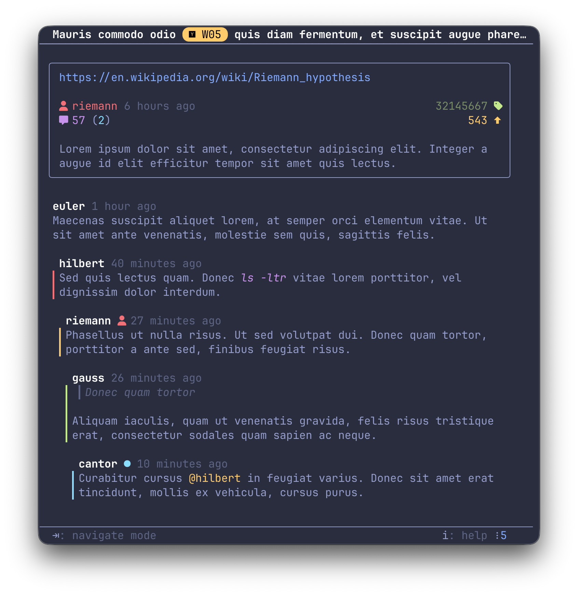
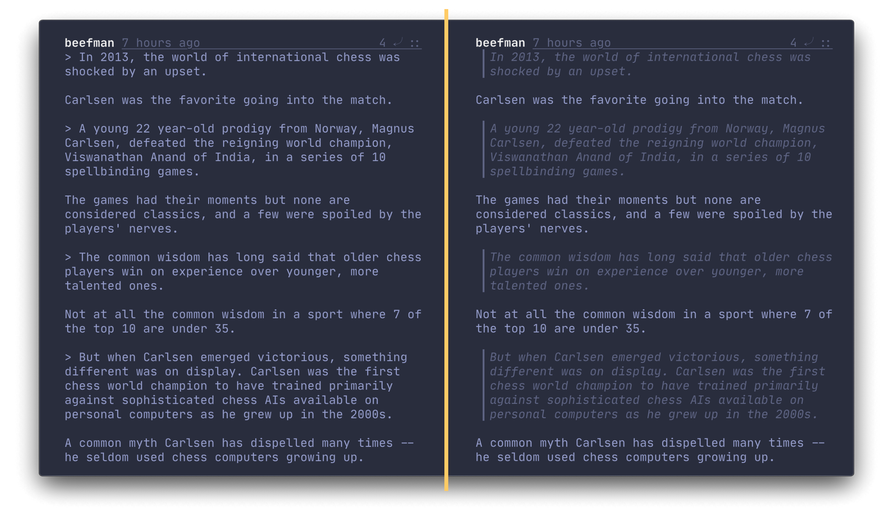
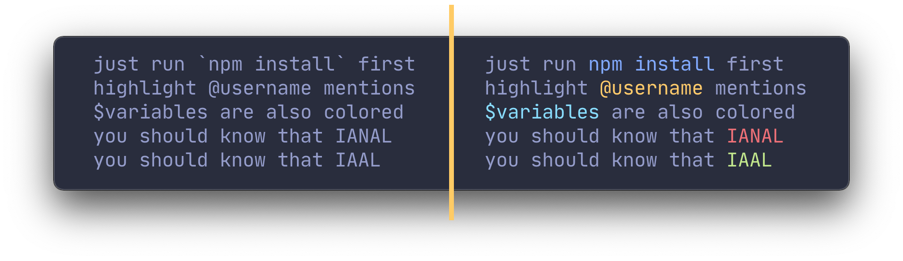
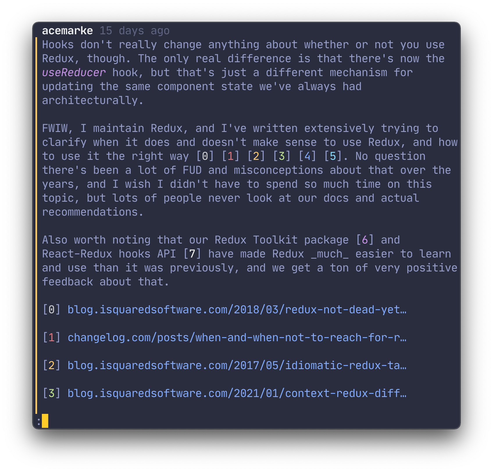
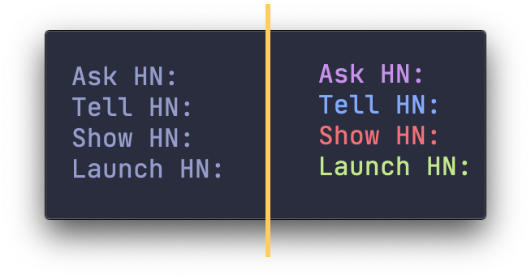
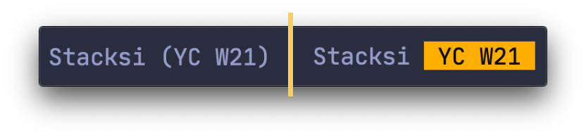
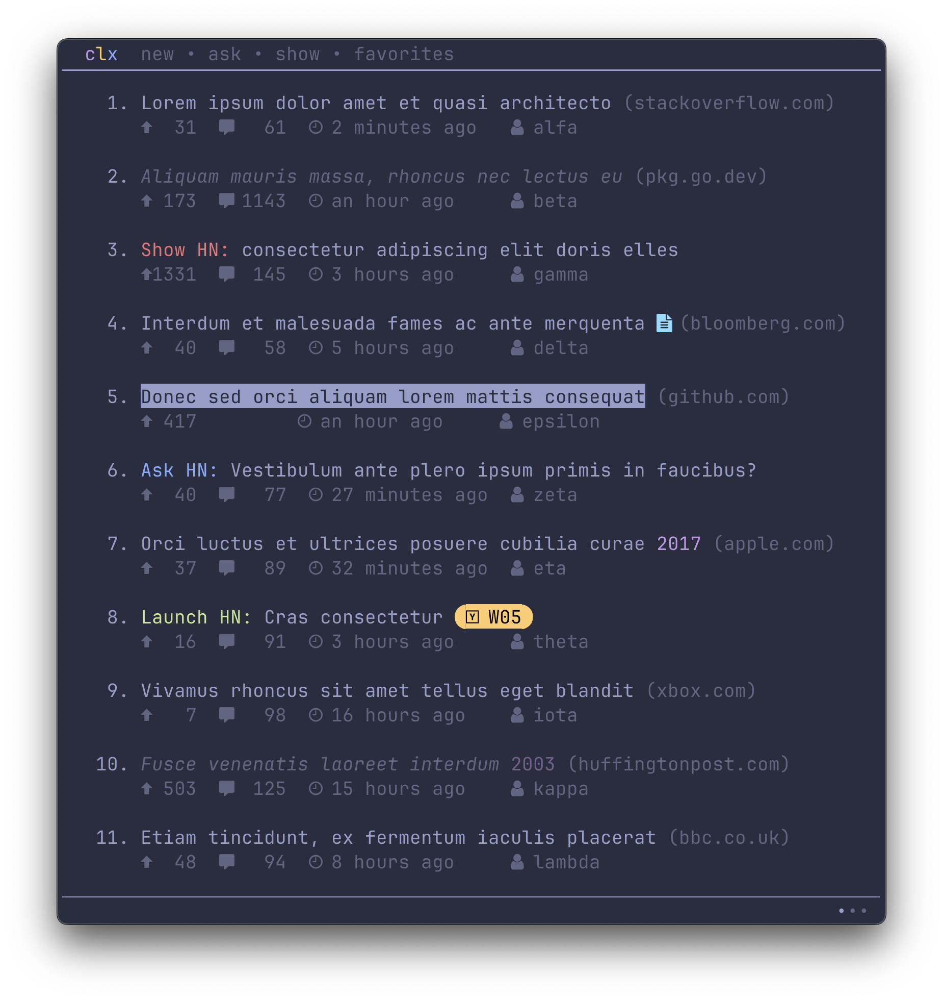
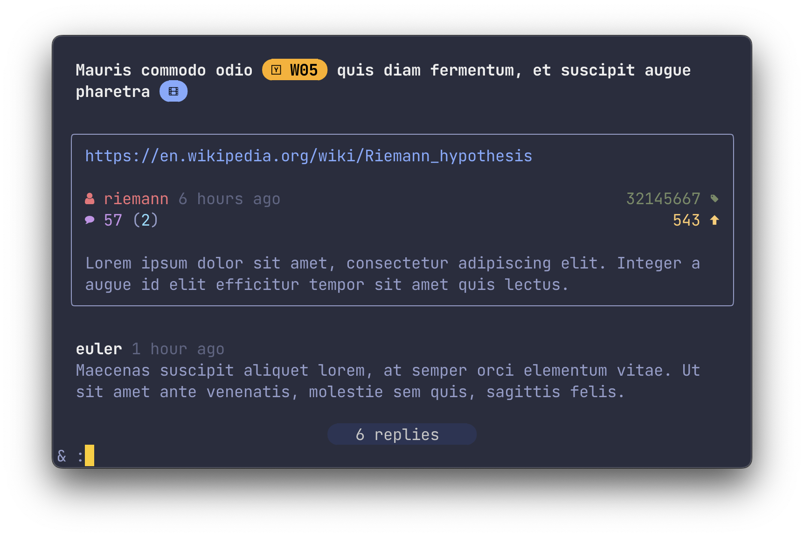
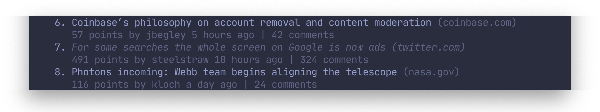
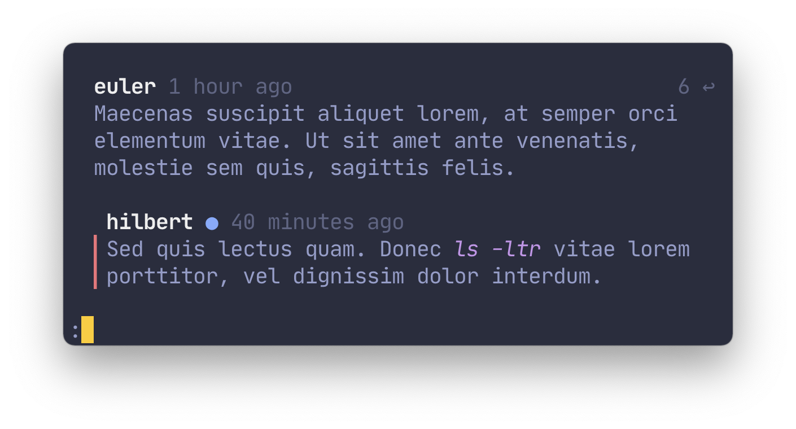

<p align="center">
  
</p>
     
#
     
<p align="center">
  <code>circumflex</code> is a command line tool for browsing Hacker&nbsp;News in your terminal
</p>
  

<p align="center">
  
</p>


### Main features

- 🛋 **Everything in one place** — read both the comment section and articles in Reader Mode
- 🌈 **Syntax highlighting** — syntax-aware formatting for comments and headlines
- ⚡️ **Read it with `less`** — use the pager you already know for quick and simple navigation 

**You might also like:**
- 🤹 **Native terminal colors** — you bring your own color scheme, `circumflex` does the rest
- 💎 **Nerd Fonts** — full support for Nerd Fonts as icons  
- ❤️ **Add to favorites** — save interesting submissions for later

#

### Table of Contents

* [Installing](#installing)
* [Comment section](#comment-section)
* [Reader mode](#reader-mode)
###
* [Syntax highlighting](#syntax-highlighting)
* [Nerd Fonts](#nerd-fonts)
* [History](#history)
###
* [Favorites](#favorites)
* [Settings](#settings)
* [Keymaps](#keymaps)
###
* [Under the hood](#under-the-hood)

***

## Installing

The binary name for `circumflex` is `clx`.

#### Package managers
```console
# Homebrew
brew install circumflex

# Nix
nix-env -iA nixpkgs.circumflex

# AUR
yay -S circumflex

```

#### From source

```console
# Clone, change to dir and install
git clone https://github.com/bensadeh/circumflex.git && cd circumflex && go install
```

> **Note** 
> When building from source, make sure that `$GOPATH/bin` is in your `PATH` environment variable and
> that you are using the latest version of [`less`](http://greenwoodsoftware.com/less/).

## Comment section

### Overview

Press <kbd>Enter</kbd> to read the comment section. 

<p align="center">
  
</p>

Comments are pretty-printed and piped to the
pager `less`. To present a nice and readable comment section, `circumflex` features:

* Rainbow-colored indentation blocks
* Text formatting in **bold**, _italics_ and `code` where available
* Labels for Original Posters (`OP`), Parent Posters (`PP`) and moderators (`mod`)

### Navigation
The following pair of shortcuts are recommended for browsing and navigating the 
comment section.

- <kbd>d</kbd>/<kbd>u</kbd> to scroll half a screen
- <kbd>j</kbd>/<kbd>k</kbd> to scroll one line at a time 
- <kbd>h</kbd>/<kbd>l</kbd> to hide and show replies
- <kbd>n</kbd>/<kbd>N</kbd> to jump to the next top-level comment


## Reader mode
Press <kbd>Space</kbd> to read the submission link in Reader Mode. 

<p align="center">
  
</p>

> **Note**
> Some websites do not work well with Reader Mode. If the submission URL points to
a domain with known Reader Mode incompatibility, the link cannot be opened in Reader Mode. 
See [validator.go](/validator/validator.go) for a full list of incompatible sites.

## Syntax highlighting
### Quotes
Quotes are indented, italicized and dimmed in order to distinguish them from the rest of the comment.

<p align="center">
  
</p>

### Hacker News and forum idiosyncrasies
\`Code snippets\`, `@username` mentions, `$variables` and `URLs` are highlighted.

<p align="center">
  
</p>

### References
References on Hacker News are formatted as numbers inside brackets. `circumflex` highlights these numbers
for easier cross-referencing.

<p align="center">
  
</p>

### Categories
Headlines containing the text `Ask HN`, `Tell HN`, `Show HN` and `Launch HN` are highlighted.

<p align="center">
  
</p>

### YC-funded startups
[Twice a year](https://www.ycombinator.com/companies/), Y Combinator funds start-ups through its accelerator program.
`circumflex` highlights these startups to signalize their affiliation with YC.

<p align="center">
  
</p>

## Nerd Fonts

If you have a Nerd Fonts-patched fonts, you can run `clx` with the `-n` or `--nerdfonts` flag.

<p align="center">
  
</p>

<p align="center">
  
</p>

## History
### Mark submissions as read
Visited submissions are marked as read. 

<p align="center">
  
</p>

### Highlight new comments
Comments that are new since the last visit are highlighted.

<p align="center">
  
</p>

### Disabling history
A list of submissions (by `ID` and last time visited) are stored in `~/.cache/circumflex/history.json`. Disable marking submissions as read by 
running `clx` with the `-d` or `--disable-history` flag.

You can delete your browsing history from the command line:
```console
clx clear
```

## Favorites
Press <kbd>f</kbd> to add the currently highlighted submission to your list of favorites. Remove submissions from the 
Favorites page with <kbd>x</kbd>.

You can add any submission by its `ID` from the command line:
```console
clx add [id]
```

Favorites are stored in `~/.config/circumflex/favorites.json`. `circumflex` pretty-prints 
`favorites.json` to make it both human-readable and VCS-friendly.

## Settings
### Overview
Run `clx help` or `man clx` for a list of available commands and settings.

### Commands

```console
add [ID]   Add item to list of favorites by ID
view [ID]  Go directly to the comment section by ID
read [ID]  Read the linked article associated with 
           an item based on the ID
clear      Clear the history of visited IDs
```
### Flags

```console
-a, --auto-expand         automatically expand all replies upon 
                          entering the comment section
    --categories=[string] set the categories in the header 
                          (default "frontpage,newest,ask,show")
-c, --comment-width=[int] set the comment width 
                          (default 70)
-e, --disable-emojis      disable conversion of smileys to emojis
-d, --disable-history     disable marking stories as read
-h, --help                help for clx
-t, --hide-indent         hide the indentation bar to the left of 
                          the reply
-n, --nerdfonts           enable Nerd Fonts
    --no-less-verify      disable checking less version on startup
-o, --plain-comments      disable syntax highlighting for comments
-p, --plain-headlines     disable syntax highlighting for headlines
-v, --version             version for clx
```


## Keymaps

Press <kbd>?</kbd>/<kbd>i</kbd> to show a list of available keymaps:

| Key              | Description                     |
|:-----------------|:--------------------------------|
| <kbd>Enter</kbd> | Read comments                   |
| <kbd>Space</kbd> | Read article in Reader Mode     |
| <kbd>r</kbd>     | Refresh                         |
| <kbd>Tab</kbd>   | Change category                 |
| <kbd>o</kbd>     | Open link to article in browser |
| <kbd>c</kbd>     | Open comment section in browser |
| <kbd>f</kbd>     | Add to favorites                |
| <kbd>x</kbd>     | Remove from favorites           |
| <kbd>q</kbd>     | Quit                            |


## Under the hood

`circumflex` uses:

* [Bubble Tea](https://github.com/charmbracelet/bubbletea) for the TUI
* [cobra](https://github.com/spf13/cobra) for the CLI
* [Algolia's Search API](https://hn.algolia.com/api) for submissions
* [cheeaun's unofficial Hacker News API](https://github.com/cheeaun/node-hnapi) for comments
* [`less`](http://greenwoodsoftware.com/less/) for viewing comments and articles
* [go-term-text](https://github.com/MichaelMure/go-term-text) and [lipgloss](https://github.com/charmbracelet/lipgloss) for text formatting
* [go-readability](https://github.com/go-shiori/go-readability), [html-to-markdown](https://github.com/JohannesKaufmann/html-to-markdown) 
and [Glamour](https://github.com/charmbracelet/glamour) for formatting

Screenshots use:

* [iTerm2](https://iterm2.com/) for the terminal
* [Palenight Theme](https://github.com/JonathanSpeek/palenight-iterm2) for the color scheme
* [JetBrains Mono](https://github.com/JetBrains/JetBrainsMono) for the font
