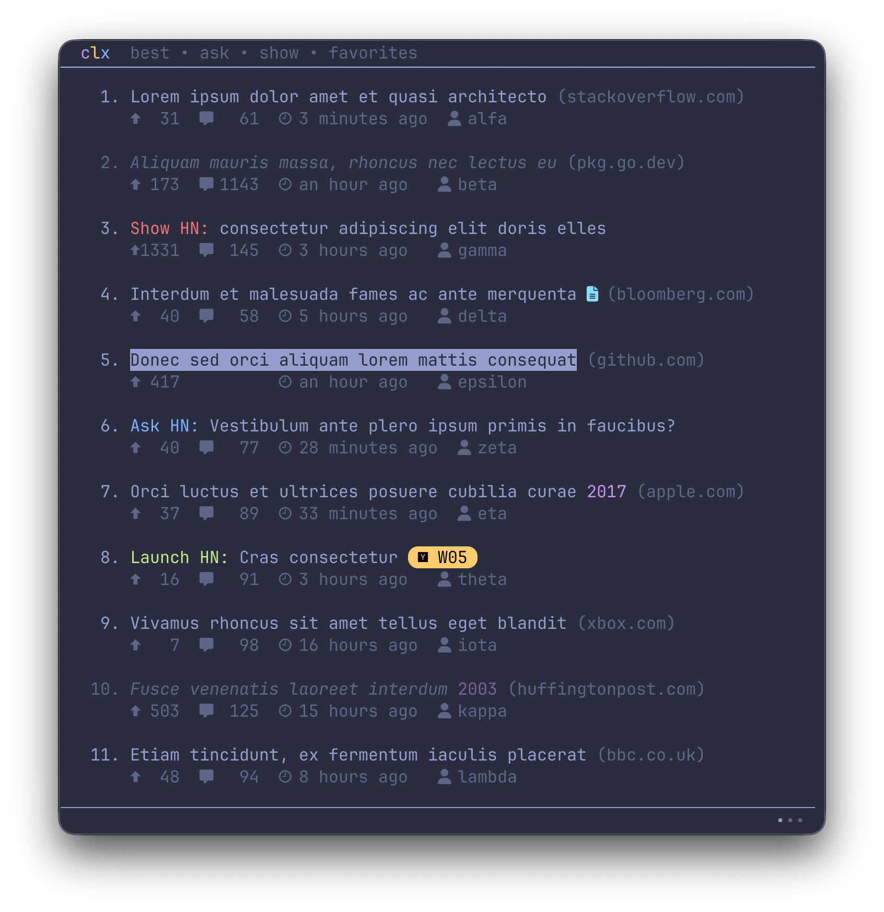
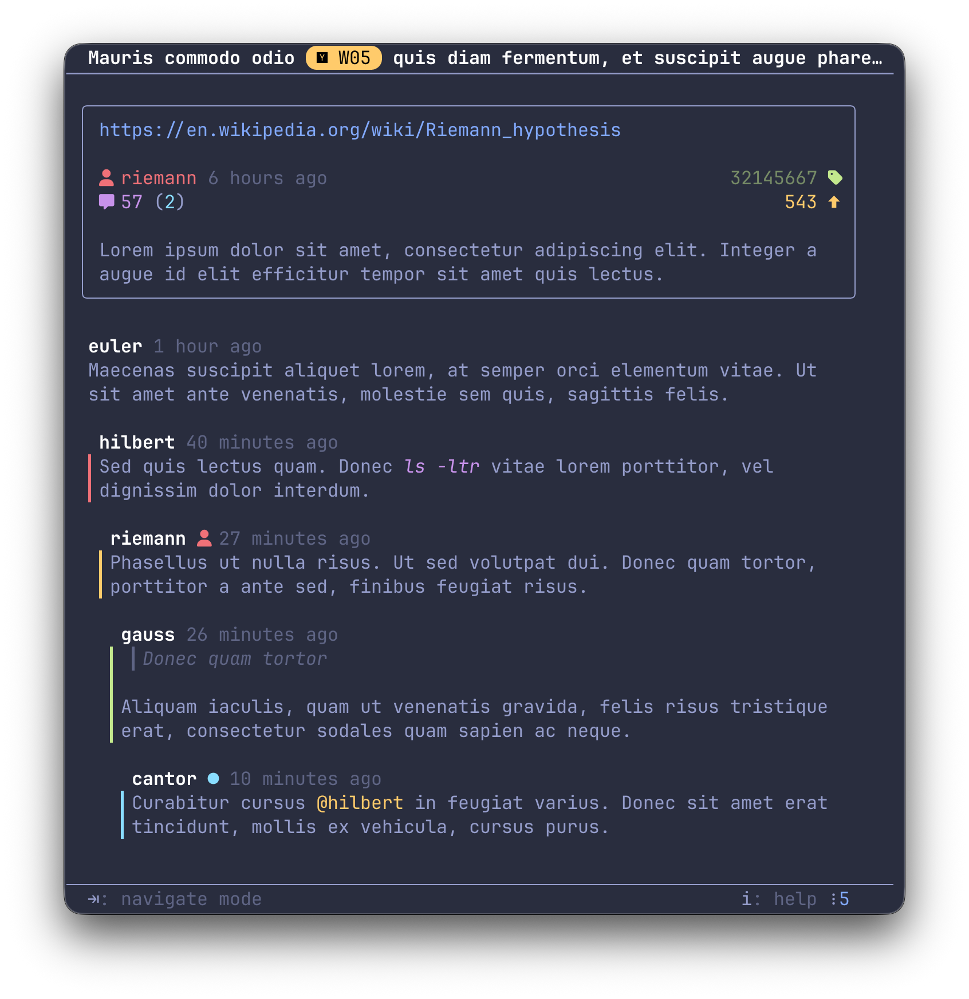
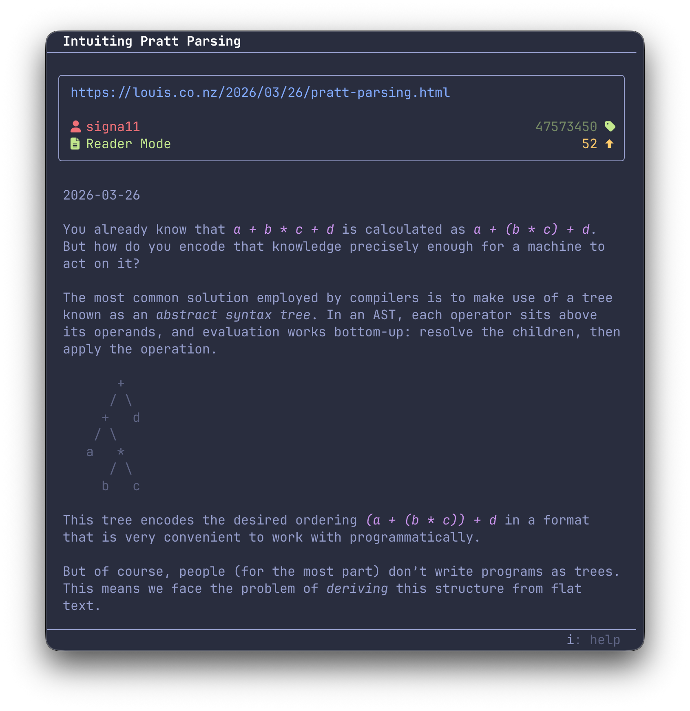

<p align="center">
  
</p>

#

<p align="center">
  <code>circumflex</code> is a command line tool for browsing Hacker&nbsp;News in your terminal
</p>


<p align="center">
  
</p>

### Main features

- 🛋 **Everything in one place** — read both the comment section and articles in Reader Mode
- 🌈 **Syntax highlighting** — syntax-aware formatting for comments and headlines
- ⚡️ **Vim-style navigation** — scroll through, jump between and collapse threads with familiar keybindings

**You might also like:**

- 🤹 **Native terminal colors** — you bring your own color scheme, `circumflex` does the rest
- 💎 **Nerd Fonts** — full support for Nerd Fonts as icons
- ❤️ **Add to favorites** — save interesting submissions for later

## Installing

The binary name for `circumflex` is `clx`.

```console
# Homebrew
brew install circumflex

# Nix
nix-shell -p circumflex

# AUR
yay -S circumflex

# Go
go install github.com/bensadeh/circumflex/cmd/clx@latest

# From source
go run ./cmd/clx
```

## Features

### Comment section

Press <kbd>Enter</kbd> to view the comment section.

The comment section has two modes: `read mode` and `navigate mode`.

In `read mode`, you can scroll using the usual vim bindings. You can also jump between top-level comments (<kbd>
n</kbd>/<kbd>N</kbd>), and you can expand and collapse threads by quote level (<kbd>h</kbd>/<kbd>l</kbd>) or all at
once (<kbd>Enter</kbd>).

In `navigate mode`, you can individually select comments and collapse specific threads. This is useful in longer threads
with many replies.

<p align="center">
  
</p>


`circumflex` is read-only and does not support for logging in, voting or commenting.

### Reader Mode

Press <kbd>Space</kbd> to read the linked article in Reader Mode. Just like in the comment section, you can jump between
headers using <kbd>n</kbd>/<kbd>N</kbd>, and you can scroll using the usual vim bindings.

<p align="center">
  
</p>

## Usage

Run `clx help` or `man clx` for a full list of available commands, flags and keymaps. Press <kbd>i</kbd> to bring up
all the keybindings for the current view.
