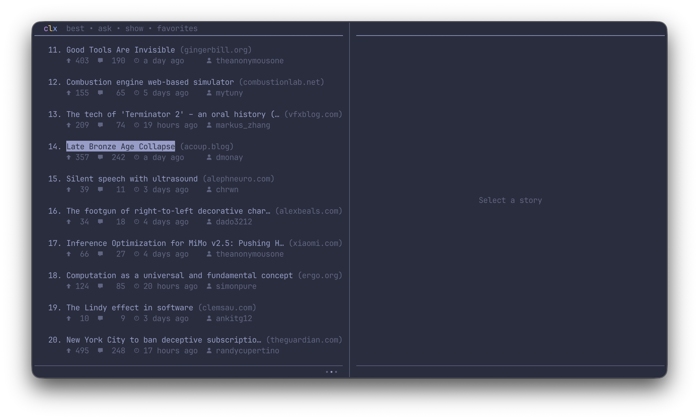
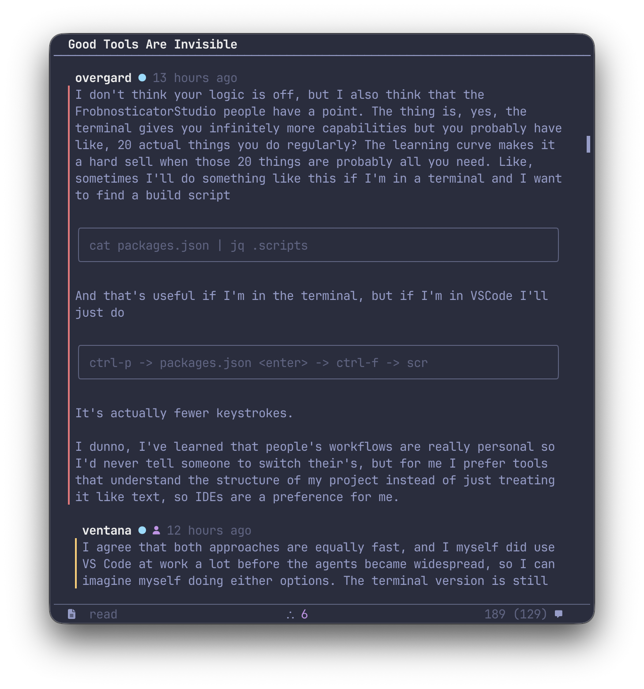
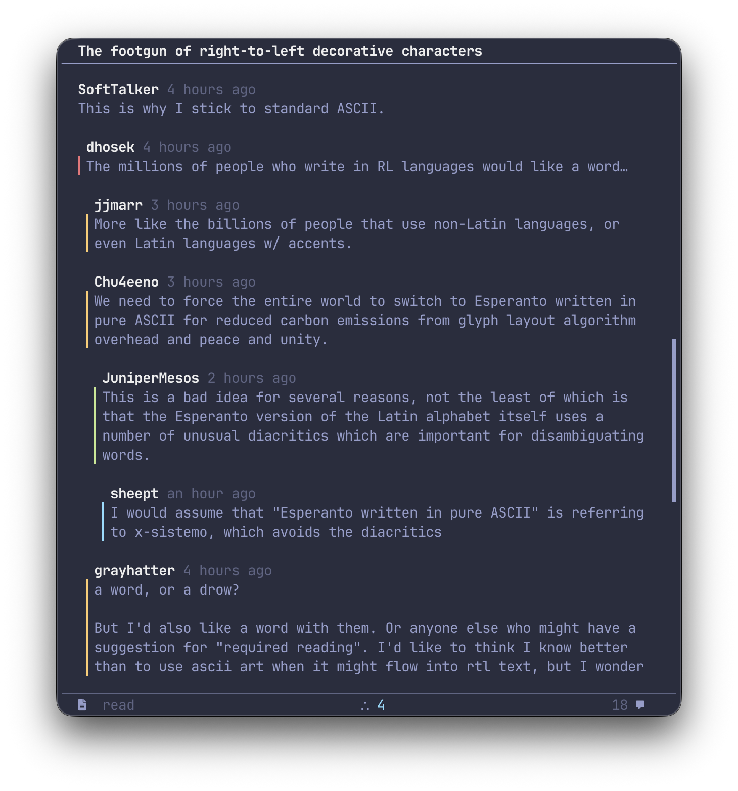
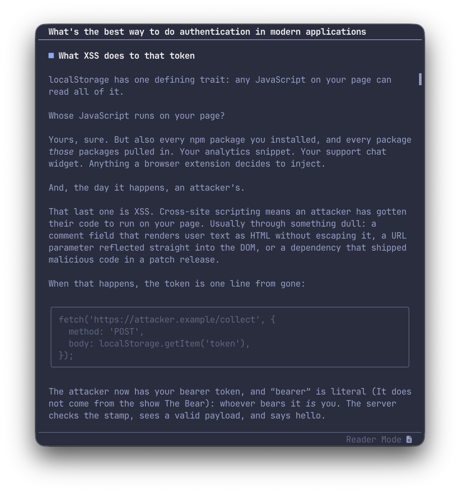
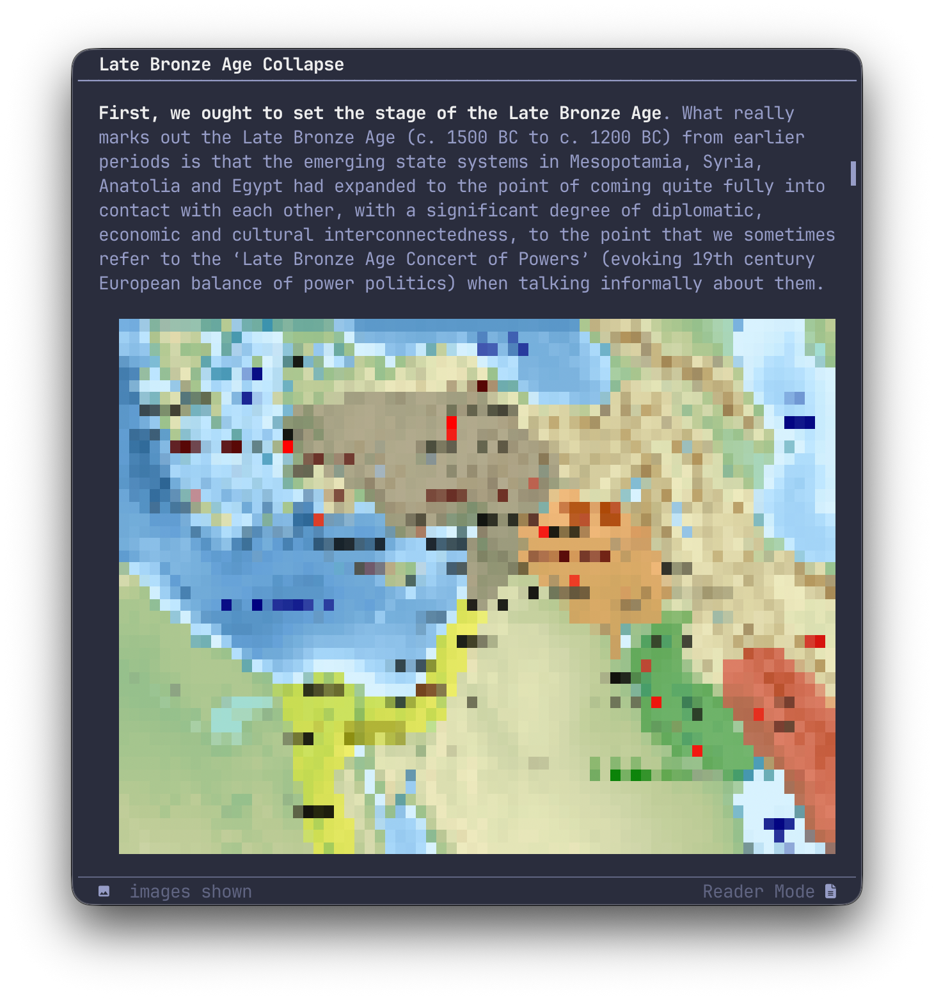

<p align="center">
  
</p>

#

<p align="center">
  <code>circumflex</code> is a command line tool for browsing Hacker&nbsp;News in your terminal
</p>


<p align="center">
  
</p>

### Main features

- 🛋 **Everything in one place** — read both the comment section and articles in Reader Mode
- 🌈 **Syntax highlighting** — syntax-aware formatting for comments and headlines
- ⚡️ **Vim-style navigation** — scroll through, jump between and collapse threads with familiar keybindings

**You might also like:**

- 🤹 **Native terminal colors** — you bring your own color scheme, `circumflex` does the rest
- 💎 **Nerd Fonts** — full support for Nerd Fonts as icons
- ❤️ **Add to favorites** — save interesting submissions for later

## Installing

The binary name for `circumflex` is `clx`.

```console
# Homebrew
brew install circumflex

# Nix
nix-shell -p circumflex

# AUR
yay -S circumflex

# Go
go install github.com/bensadeh/circumflex/cmd/clx@latest

# From source
go run ./cmd/clx
```

## Features

### Comment section

Press <kbd>Enter</kbd> to view the comment section.

The comment section has two modes: `read mode` and `navigate mode`.

In `read mode`, you can scroll using the usual vim bindings. You can also jump between top-level
comments (<kbd>n</kbd>/<kbd>N</kbd>), and you can expand and collapse threads by quote level
(<kbd>h</kbd>/<kbd>l</kbd>) or all at once (<kbd>Enter</kbd>).

In `navigate mode`, you can individually select comments and collapse specific threads. This is useful in longer threads
with many replies.

<p align="center">
  
  
</p>


`circumflex` is read-only and does not support logging in, voting or commenting.

### Reader Mode

Press <kbd>Space</kbd> to read the linked article in Reader Mode. Just like in the comment section, you can jump between
headers using <kbd>n</kbd>/<kbd>N</kbd>, and you can scroll using the usual vim bindings.

<p align="center">
  
  
</p>

### Favorites

Press <kbd>f</kbd> to add the highlighted submission to your favorites. Remove it with <kbd>x</kbd>.

You can also add a submission by `ID` from the command line:

```console
clx add [id]
```

Favorites are stored in `~/.config/circumflex/favorites.json` and pretty-printed to be human-readable and VCS-friendly.

### History

Visited submissions are marked as read, and comments added since your last visit are highlighted.

History is stored in `~/.cache/circumflex/history.json`. Disable tracking with `-d`/`--disable-history`, or clear it
with:

```console
clx clear
```

### Categories

Switch between categories with <kbd>Tab</kbd>. The header shows `top`, `best`, `ask`, `show` and `favorites` by
default. Pick which ones appear (and in what order) with the `--categories` flag:

```console
clx --categories top,new,best
```

Available categories are `top`, `best`, `new`, `ask`, `show`, `jobs` and `favorites`.

### Theme

`circumflex` uses your terminal's color scheme by default. To customize, write out the default config and edit it:

```console
clx default-theme
```

The theme lives at `~/.config/circumflex/theme.toml` and accepts named colors, hex codes, and ANSI 256 values.

## Keymaps

Main view keybindings — press <kbd>i</kbd> in any view for the full list, including comment and reader mode.

| Key              | Action                   |
|:-----------------|:-------------------------|
| <kbd>Enter</kbd> | View comments            |
| <kbd>Space</kbd> | Reader Mode              |
| <kbd>Tab</kbd>   | Next category            |
| <kbd>r</kbd>     | Refresh stories          |
| <kbd>o</kbd>     | Open story in browser    |
| <kbd>c</kbd>     | Open comments in browser |
| <kbd>f</kbd>     | Add to favorites         |
| <kbd>x</kbd>     | Remove from favorites    |
| <kbd>u</kbd>     | Toggle read              |
| <kbd>q</kbd>     | Quit                     |

## Usage

Run `clx help` or `man clx` for a full list of available commands and flags.
