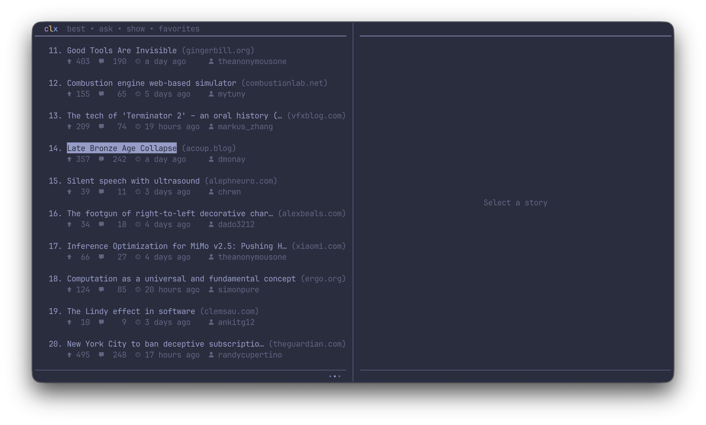
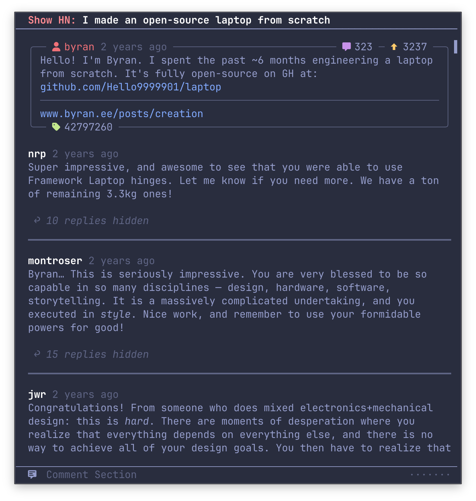
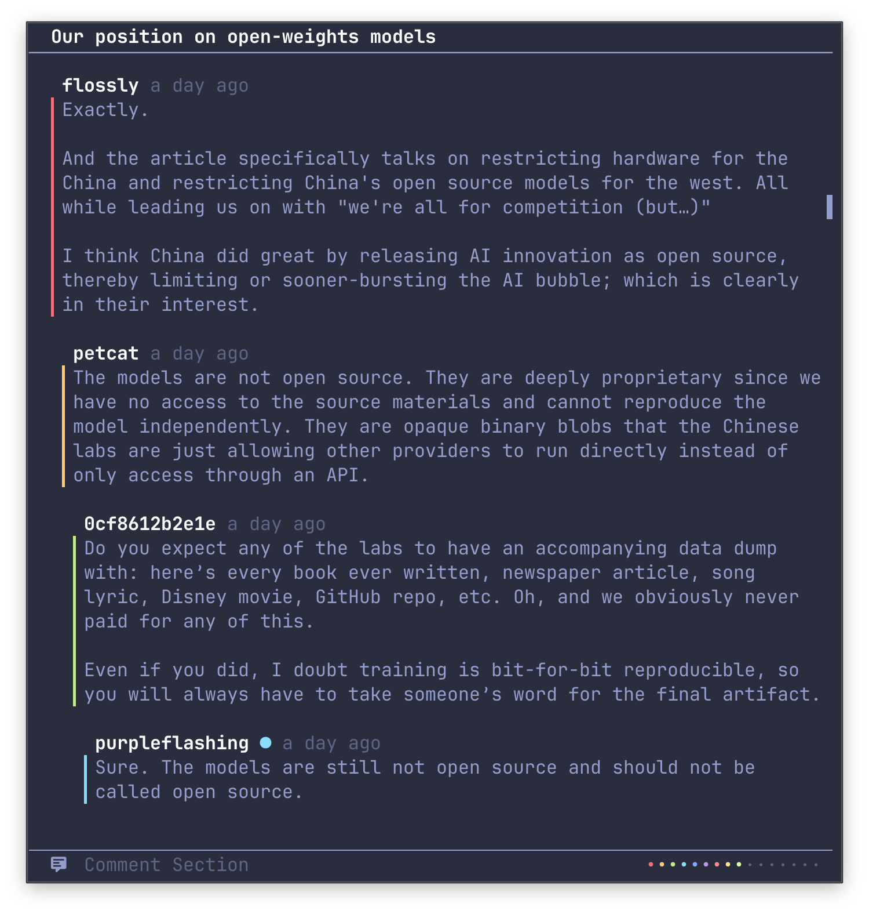
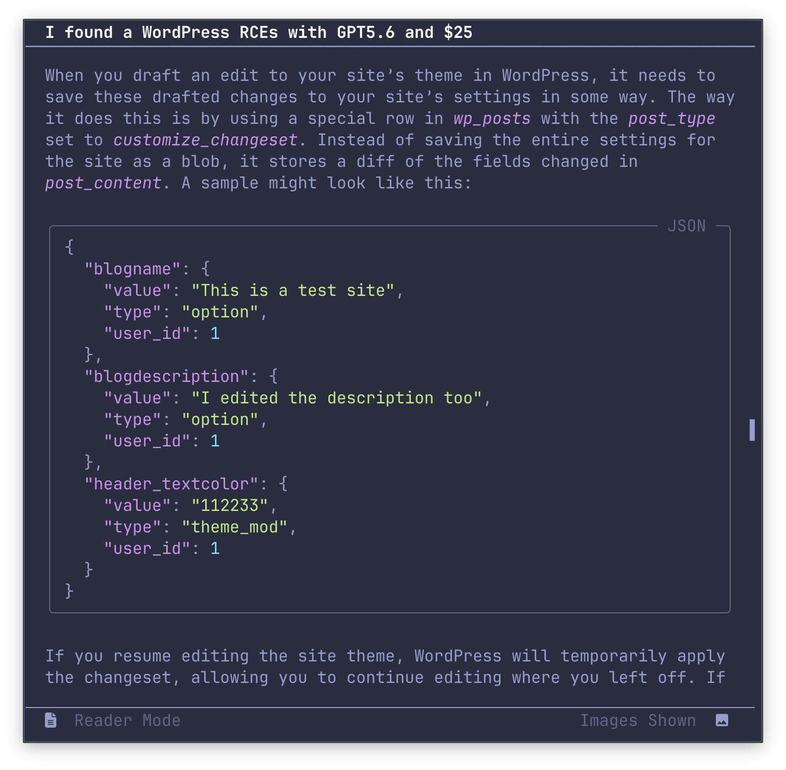
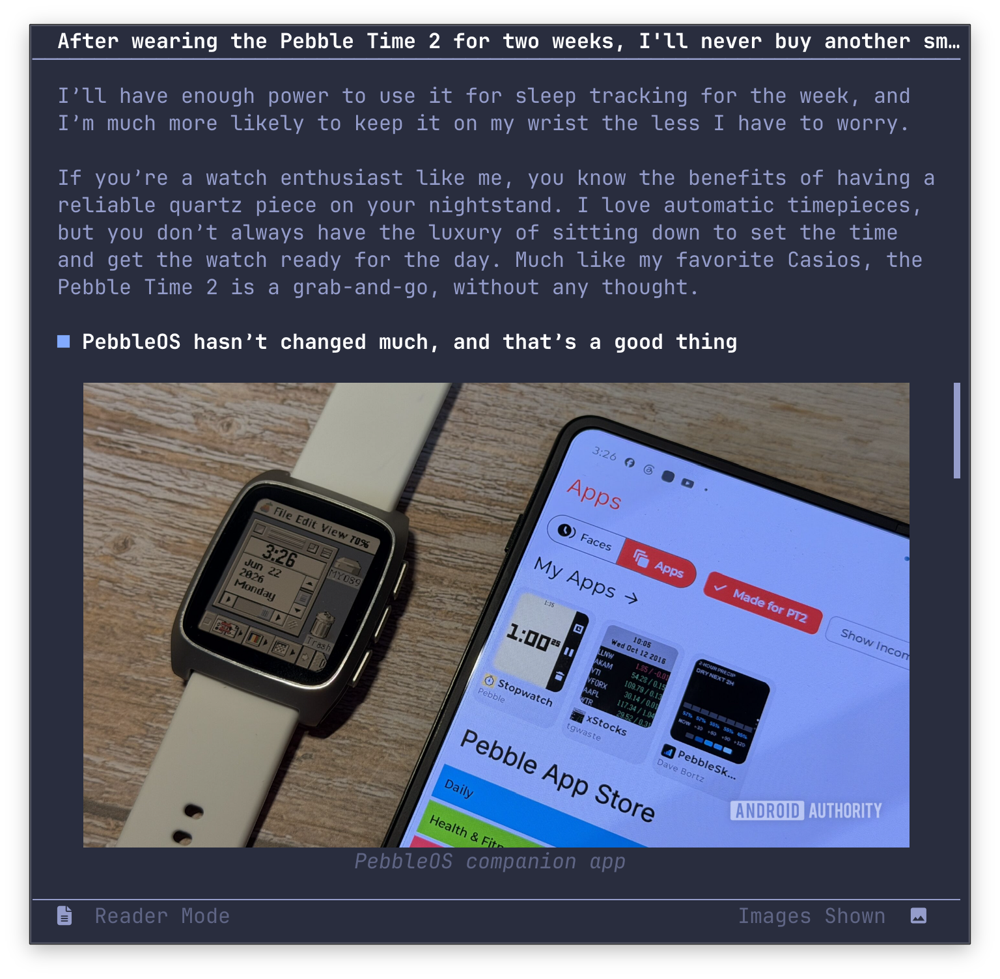

<p align="center">
  
</p>

#

<p align="center">
  <code>circumflex</code> is a command line tool for browsing Hacker&nbsp;News in your terminal
</p>


<p align="center">
  
</p>

### Main features

- 🛋 **Everything in one place** — read both the comment section and articles in Reader Mode
- 🌈 **Syntax highlighting** — syntax-aware formatting for comments and headlines
- ⚡️ **Vim-style navigation** — scroll through, jump between and collapse threads with familiar keybindings

**You might also like:**

- 🔍 **Search** — quickly find old submissions by searching all of HN
- 🪟 **Wide view** — story list and content side by side on wide terminals
- 🤹 **Native terminal colors** — you bring your own color scheme, `circumflex` does the rest
- 💎 **Nerd Fonts** — full support for Nerd Fonts as icons
- ❤️ **Add to favorites** — save interesting submissions for later

## Installing

The binary name for `circumflex` is `clx`.

```console
# Homebrew
brew install circumflex

# Nix
nix-shell -p circumflex

# AUR
yay -S circumflex

# Go
go install github.com/bensadeh/circumflex/cmd/clx@latest

# From source
go run ./cmd/clx
```

## Features

### Comment section

Press <kbd>Enter</kbd> to view the comment section.

The comment section has two modes: `read mode` and `navigate mode`.

In `read mode`, you can scroll using the usual vim bindings. You can also jump between top-level comments (<kbd>
n</kbd>/<kbd>N</kbd>), and you can expand and collapse threads by quote level (<kbd>h</kbd>/<kbd>l</kbd>) or all at once
(<kbd>Enter</kbd>).

Press <kbd>a</kbd> to enter `navigate mode`, where you can individually select comments and collapse specific threads.
Press <kbd>Esc</kbd> to return to `read mode`.

<p align="center">
  
  
</p>


`circumflex` is read-only and does not support logging in, voting or commenting.

### Reader Mode

Press <kbd>Space</kbd> to read the linked article in Reader Mode. Just like in the comment section, you can jump between
headers using <kbd>n</kbd>/<kbd>N</kbd>, and you can scroll using the usual vim bindings.

In terminals with Kitty graphics support, press <kbd>Enter</kbd> to show the article's images.

<p align="center">
  
  
</p>

### Link selector

Press <kbd>Tab</kbd> to select links in the comment section or in Reader Mode. Move between links with
<kbd>j</kbd>/<kbd>k</kbd> and open the selected one with <kbd>Enter</kbd>.

Links open in place: articles in Reader Mode, links to other Hacker News discussions in the comment section. Press
<kbd>q</kbd> to go back to where you were.

### Wide view

On wide terminals (180 characters), `circumflex` opens in dual pane mode. Toggle it for the session with <kbd>z</kbd>,
or turn it off entirely with:

```console
clx --wide-view never
```

### Search

Press <kbd>/</kbd> to search all of Hacker News, powered by Algolia. Sort by popularity or date with <kbd>s</kbd> and
narrow the date range with <kbd>d</kbd>.

The comment section and Reader Mode also support search in the content with <kbd>/</kbd>: search for the term and jump
between matches with <kbd>n</kbd>/<kbd>N</kbd>.

### Favorites

Press <kbd>f</kbd> to add the highlighted submission to your favorites. Remove it with <kbd>x</kbd>.

You can also add a submission by `ID` from the command line:

```console
clx add [id]
```

Favorites are stored in `favorites.toml` in the config directory, human-readable and VCS-friendly. A
`favorites.json` from earlier versions is migrated automatically.

### History

Visited submissions are marked as read, and comments added since your last visit are highlighted.

History is stored in `history.json` in the cache directory. Disable tracking with `-d`/`--no-history`, or clear it with:

```console
clx clear-history
```

### Categories

Switch between categories with <kbd>Tab</kbd>. The header shows `top`, `best`, `ask`, `show` and `favorites` by default.
Pick which ones appear (and in what order) with the `--categories` flag:

```console
clx --categories top,new,best
```

Available categories are `top`, `best`, `new`, `ask`, `show`, `jobs` and `favorites`.

### Theme and Configuration

`circumflex` uses your terminal's color scheme by default. If you want to customize the colors or set any flags
persistently, use the following commands to write out the default config to the config directory:

```console
clx default-config
clx default-theme
```

## Keymaps

Main view keybindings — press <kbd>i</kbd> in any view for the full list, including comment and reader mode.

| Key              | Action                   |
|:-----------------|:-------------------------|
| <kbd>Enter</kbd> | View comments            |
| <kbd>Space</kbd> | Reader Mode              |
| <kbd>Tab</kbd>   | Next category            |
| <kbd>/</kbd>     | Search Hacker News       |
| <kbd>r</kbd>     | Refresh stories          |
| <kbd>o</kbd>     | Open story in browser    |
| <kbd>c</kbd>     | Open comments in browser |
| <kbd>f</kbd>     | Add to favorites         |
| <kbd>x</kbd>     | Remove from favorites    |
| <kbd>u</kbd>     | Toggle read              |
| <kbd>z</kbd>     | Toggle wide view         |
| <kbd>q</kbd>     | Quit                     |

## Usage

Run `clx help` or `man clx` for a full list of available commands and flags.
