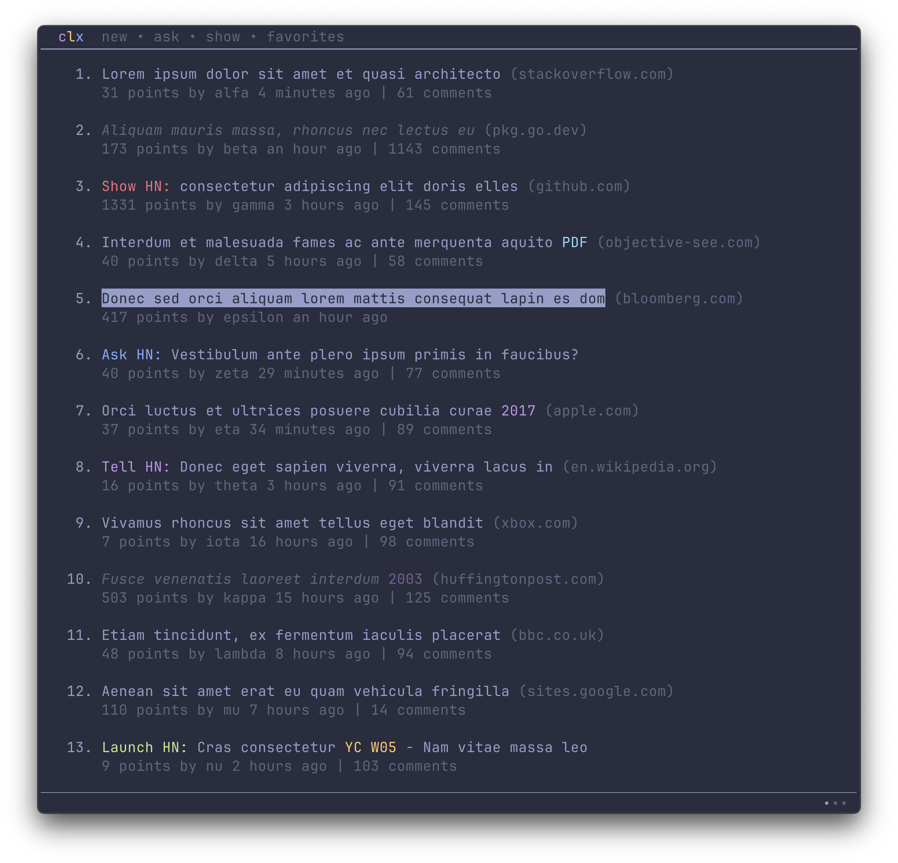

<p align="center">
  
</p>

#

<div align="center">

[](https://github.com/bensadeh/circumflex/releases)
[](https://github.com/bensadeh/circumflex/blob/master/CHANGELOG.md)
[](https://github.com/bensadeh/circumflex/blob/master/LICENSE)
[](https://github.com/bensadeh/circumflex/blob/master/go.mod)
</div>

`circumflex` is a command line tool for browsing Hacker&nbsp;News in your terminal.

<p align="center">
  
</p>

## Getting started

Install `circumflex` with Homebrew:

```console
# Install
brew install bensadeh/circumflex/circumflex

# Run
clx
```

Press <kbd>i</kbd> to show available keymaps and settings.

## Overview

### Features

`circumflex` is a text-based user interface (TUI) application that lets you browse Hacker News in your terminal. It can
list submissions by category and show the comment section. It is made to look good across different color schemes.

`circumflex` does not support any login-related functionality.

<p align="center">
  
</p>

### Comment section

Comments are pretty-printed and piped to the pager `less`. To present a nice and readable comment section,
`circumflex` features:

* Text in **bold**, _italics_, [hyperlinks](https://gist.github.com/egmontkob/eb114294efbcd5adb1944c9f3cb5feda) and
  `code` where available
* Labels for Original Posters (`OP`), Parent Posters (`PP`) and moderators (`mod`)
* Ability to jump between top-level comments by searching for `::`


### Syntax highlighting
#### Hacker News Idiosyncrasies 
For the most part, `circumflex` aims to present Hacker News as close as possible to how it appears on the website. 
However, just like in code, there are certain idiosyncratic parts of Hacker News which make sense to handle differently
for the sake of legibility. See the Settings section on how to disable some of these features.

#### Quotes

In the comment section, quotes are separated by a paragraph and open with `>` like so:
```
>This is a quote 

This is not a quote
```

To improve legibility, `circumflex` italicises and dims the actual quote. Since the formatting now identifies the block
as a quote, the symbol `>` is omitted, but the context is preserved. 

<p align="center">
  
</p>

#### Headlines
Certain submissions on the front page are also in their own 'category', such as `Show HN` and `Ask HN`. `circumflex` 
colorizes these parts of the headlines.

<p align="center">
  
</p>

#### YC-funded startups
[Twice a year](https://www.ycombinator.com/companies/), Y Combinator funds start-ups through its accelerator program. 
YC-funded startups are referred to in the following format:

```
[Startup name] (YC [(W)inter or (S)ummer batch][Year of funding])

For example:
Dropbox (YC S07)
Airbnb (YC W09)
```

`circumflex` highlights YC-funded startups in orange to signalize their affiliation with YC. 

<p align="center">
  
</p>

#### References
References are most often listed in the following format: `[1]`, `[2]`, `[…]`. `circumflex` highlights the numbers 
inside the references for easier cross-referencing.

<p align="center">
  
</p>

## Settings

### How to configure
The available options and their current values are displayed in the Settings View. Overridden values are marked with
`*`. To enter Settings View, press <kbd>i</kbd> on the Main View and then <kbd>Tab</kbd> to change the category. Note 
that the settings cannot be changed from the Settings View.

To change the settings, you can:

1. Edit `config.env` in `~/.config/circumflex`, or
2. Set environment variables in your shell

#### Changing settings with `config.env`
`circumflex` can create a `config.env` in `~/.config/circumflex` by pressing <kbd>t</kbd> in the Settings View. This
file will contain the available options, their descriptions and default values.

#### Changing settings with environment variables
Depending on your preference, it might be more convenient for you to configure `circumflex` by setting 
[environment variables](https://unix.stackexchange.com/questions/117467/how-to-permanently-set-environmental-variables).

Bash and zsh:
```bash
export CLX_COMMENT_WIDTH=65
```

Fish:
```fish
set -x CLX_COMMENT_WIDTH "65"
```

<p align="center">
  
</p>

### Available options

The following table shows the ways `circumflex` can be configured.

| Key                         | Default Value | Description |
| :-------------------------: | :-------: |---|
| `CLX_COMMENT_WIDTH`         | `70` | Sets the maximum number of characters on each line for comments, replies and descriptions in settings. Set to 0 to use the whole screen.       |
| `CLX_INDENT_SIZE`           | `4` | The number of whitespaces prepended to each reply, not including the color bar.        |
| `CLX_HIGHLIGHT_HEADLINES`   | `2` | Highlights YC-funded startups and text containing `Show HN`, `Ask HN`, `Tell HN` and `Launch HN`. Can be set to 0 (No highlighting), 1 (inverse highlighting) or 2 (colored highlighting).        |
| `CLX_RELATIVE_NUMBERING`    | `false` | Shows each line with a number relative to the currently selected element. Similar to Vim's hybrid line number mode.        |
| `CLX_HIDE_YC_JOBS`          | `true` | Hides `X is hiring` posts from YC-funded startups. Does not affect the monthly `Who is Hiring?` posts.        |
| `CLX_PRESERVE_RIGHT_MARGIN` | `false` | Shortens replies so that the total length, including indentation, is the same as the comment width. Best used when Indent Size is small to avoid deep replies being too short.   |

## Under the hood

`circumflex` uses:

* [tcell](https://github.com/gdamore/tcell) and [cview](https://gitlab.com/tslocum/cview) for the TUI
* [viper](https://github.com/spf13/viper) for reading and setting configurations
* [cheeaun's unofficial Hacker News API](https://github.com/cheeaun/node-hnapi) for providing submissions and comments
* [`less`](http://greenwoodsoftware.com/less/) for viewing comments
* [go-term-text](https://github.com/MichaelMure/go-term-text) for text formatting

Screenshots use:

* [iTerm2](https://iterm2.com/) for the terminal
* [Palenight Theme](https://github.com/JonathanSpeek/palenight-iterm2) for the color scheme
* [JetBrains Mono](https://github.com/JetBrains/JetBrainsMono) for the font
